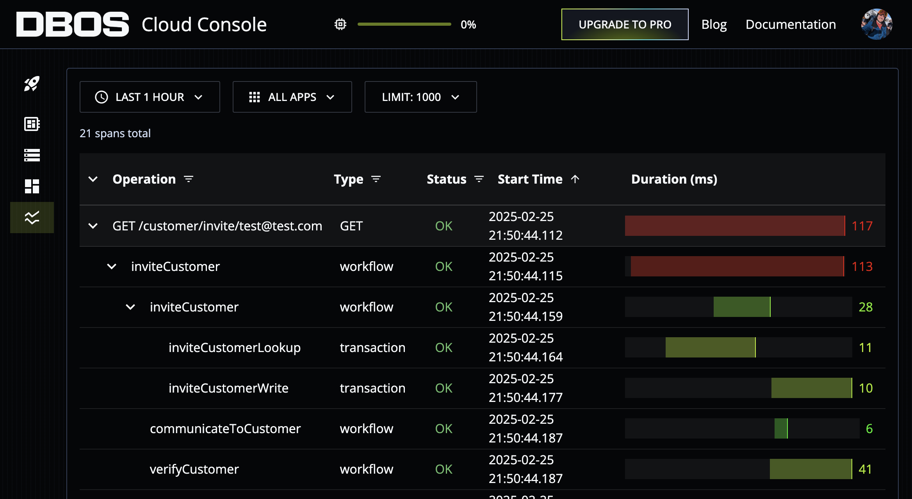
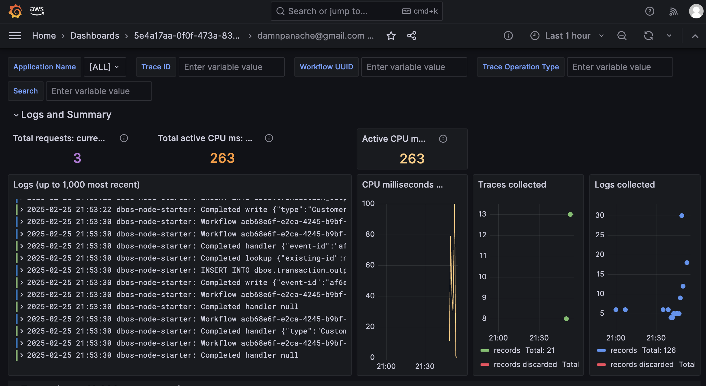

## Managed workflow on DBOS
The appeal of DBOS is the amount you get for free: tracing and reliable, replayable workflows. Its not quite CQRS (I didn't include the projections), but could fill a really important role in a transactional system.  The API for DBOS is Typescript and uses decorators.  The approach I've taken is:

* Workflow functions are all using [clojure](app/src/clj/handlers.clj) using the existing event handlers
* Typescript low-level workflow definitions for these functions are generated from these handlers [clojure](scripts/generate.clj)
* These workflows are used from hand written high-level workflows (app/src/ts/InviteCustomer.ts)

This adheres to the LOW pattern for the individual workflow functions, and uses the same clojure as previous projects.  The high level workflow is Typescript (see below), and this trade-off feels reasonable.  When moving to a new architecture the clojure would remain the same (assuming use of a SQL database), but the workflow, which are relatively simple to reproduce, would be rewritten in the new language.  It was simple to use the imported clojure; implementing some sort of translation for the high level workflow would be clunky and error prone.


```typescript
    @DBOS.workflow()
    static async inviteCustomer(inviteCustomerEvent: any): Promise<any> {

        const inviteCustomerResult = await Workflows.inviteCustomer(inviteCustomerEvent);

        if(inviteCustomerResult.type === "CustomerInvited") {
            Workflows.communicateToCustomer(inviteCustomerResult);
            
            const verifyCustomerResult = await Workflows.verifyCustomer(inviteCustomerResult);
            if(verifyCustomerResult.type === "CustomerVerified") {
                Workflows.communicateToCustomer(verifyCustomerResult);
            }
        }
        return inviteCustomerResult;
    }
```

### Challenges
The DBOS SDK is a fairly young project, there were some challenges in getting it set up, and understanding how it worked.  Most of the work for getting the clojure working was already completed in the AWS serverless project.

### DBOS Dashboard
The DBOS dashboard is a really useful tool for debugging and monitoring workflows.  




