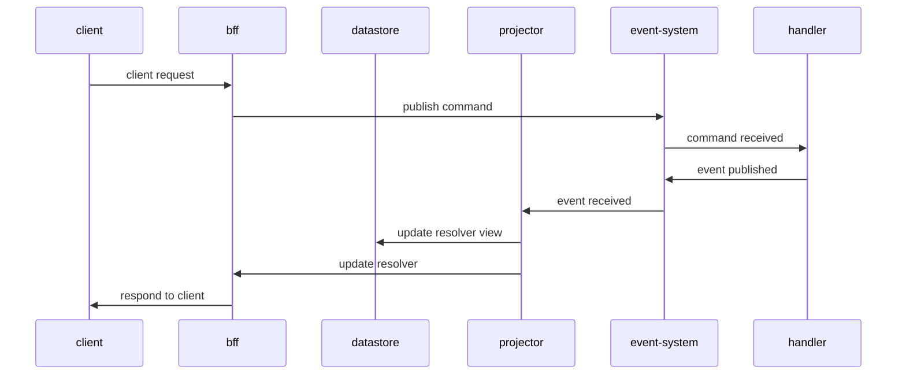

### Purpose

This repo explores a pattern for writing an event driven CQRS system that can 
* be used in a small system 
* separates the essential complexity (your business logic) from the accidental complexity (how the code is deployed and run) (see [Out of the tarpit](https://curtclifton.net/papers/MoseleyMarks06a.pdf))

### Background

I (and I imagine you) have worked at many companies where there is an itch to re-write *that* system.  This itch may come from a need to scale the system, make it easier to work with, evolve away from deprecated or outdated tech, or, possibly, there is a new technology the company feels may help improve its operations in some way.  This itch *only ever* applies to successful software, and succesful software generally 
* is not still; new features are being added all the time
* has a great deal of value locked up in its code

This presented these companies with a conundrum - re-writing the business logic was perceived as too risky and costly, and its was inconceivable to imagine extracting the essential business logic from the way it interacted with its environment (file system, network, database).  Generally, it just never happens, which causes the company a (usually undetermined) opportunity cost.

When starting a greenfield project you hope to be successful, you will make certain architectural and technology decisions that will ensure its success.  You may well be right, but will you be right in one year when the community moves away from that framework?  In 2 years, when you find a new market for the software that requires hugely increased scalability and worldwide instant response speeds?  Or 5 years, when technology x loses business support contracts?  All architecture is wrong, eventually.
### Structure
There are 3 folders in this project
* `functions` holds the essential functions - you expect no change over time
* `projects` hold the deployable/runnable implemtations of the functions in a particular environment
* `shell` holds the code that provides the environment to the functions.  It's synonymous with the idea of a 'platform', but I prefer the term [shell](https://www.destroyallsoftware.com/screencasts/catalog/functional-core-imperative-shell); the real value is in your functions, the shell is cattle, not a pet. 
### Process
I started from the premise that in any typical ES/CQRS system there are 4 important processes
* route handlers (how does a POST to /accounts get interpreted?)
* event handlers (the essential logic of the system)
* projectors (given the changes to the system, what does that look like to the outside world?)
* resolvers (how do we tie a request to a response?)
In the view below, route handlers and resolvers are deployed in the bff (backend for frontend)


I took a very simple business process (invite a customer by email) and wrote the functions to perform each of these (I cheated and skipped the first one as I'll explain later).  You can see them [here](functions/src).  My goal was to attempt a number of different projects (ie deployments of the same code with different tech) while changing these functions as little as possible, so by the time I was done, I would be confident I had a good pattern to allow an [evolutionary architecture](https://www.thoughtworks.com/en-gb/insights/books/building-evolutionary-architectures). The projects are:

* [A simple implementation](projects/basic-async/) - no http interface and using [core.async](https://github.com/clojure/core.async) to provide the event system.
* [Introducing graphql](projects/gql-async/) - this is my 'cheat' - since graphql mutations map 1:1 with commands, I could define my route handler with a graphql schema.  A similar thing could be done with REST, but graphql gave me the fastest way to route handling/validation.
* [Introducing kafka](projects/gql-kafka/) - if we want to scale, these functions could be deployed on separate machines, so I'm using confluent cloud to demonstrate this
* [Introducing xtdb](projects/gql-kafka-xtdb/) - we scaled our processes, but not our data.  Using xtbd allows us to provide incredible read scale, on top of the kafka we're already using.
* [Introducing postgres](projects/gql-kafka-xtdb-postgres/) - While xtdb is great for providing reads downstream, it leaves us with an important gap; referential integrity.  Postgres would allow us to perform multiple checks on our data (including UPDATE... WHERE...), meaning we don't accept an event into the system unless we're really sure it's valid.
* [Introducing datomic](projects/gql-kafka-datomic/) - I'm a datomic fan, and while it has some downsides (single write with unclear max throughput, hard limit on db size) it has some wonderful characteristics that are worth exploring

Note there is also a 'fifth project' in the [unit test](functions/test/core_test.clj) of the functions.  This is really important; the essential logic can be tested very simply and very quickly.

### The pattern
The pattern has been codified as [protocols](shell/src/common/protocol.clj), but this will translate to any language.  I'm calling this the LOW pattern - lookup, operate, write.
#### Handler
```
(defprotocol IHandler
  (lookup [this ctx event])
  (operate [this ctx event data])
  (write [this ctx event])
  (operator-meta [this]))
  ```

The job of `lookup` is to provide data to the operate function - all data reads should happen here.  This abstraction means you're not setting up your unit test to operate on a database, and when you move to a different database, your core logic doesn't change *at all*.

The key business functions will happen in `operate` - this is where the real value happens.  It takes context (a logger, or metadata about the system), an event (or command) and the data provide by `lookup`.  Note the event returned by `operate` is considered a valid event to be written to the system - we should expect to rely on this event to rebuild local datastores in the future, so it must include all information needed.

`write` makes any changes to the local datastore based on the event. It includes referential integrity checks, so is able to fail.  Note that, should we want to rebuild our local datastore on a different technology, we'll be calling this function for each historic event.

`operator-meta` - the operator is the only thing that doesn't change in the system as we evolve it, so it's the thing that holds important data about how it interacts with the environment.  This pulls that metadata out:
```
^{:in [:commands] :out :customer :name :invite-customer-event-handler} 
```
This describes the input and output channels, and the name, but can hold anything your system needs.
#### Executor
```
(defprotocol IExecute
  (execute [this ctx event])
  (executor-meta [this]))

(deftype Executor [^common.protocol.IHandler h]
  IExecute
  (execute [_ ctx event]
    (let [_ctx (assoc ctx :event-notify-ch (partial (:notify-ch ctx) event))]
      (->> event
           (lookup h _ctx)
           (operate h _ctx event)
           (write h _ctx))))
  (executor-meta [_]
    (operator-meta h)))
```
The executor simply takes the handler and executes its functions.  The structure of this component is not particularly important except for one feature - it orchestrates the operation of the handler.  This might mean logging, transaction handling, or even running many handlers in a thread pool.  This abstraction gives us complete control over the way our handlers are implemented.

### Running
All graphql projects can be started from the repl
```
projects/gql-kafka-datomic >> clojure -Mrebel
[Rebel readline] Type :repl/help for online help info
user=> (load-file "src/core.clj")
WARNING: requiring-resolve already refers to: #'clojure.core/requiring-resolve in namespace: datomic.common, being replaced by: #'datomic.common/requiring-resolve
#'core/stop
user=> (core/start)
```
and you can use a graphql client to test the service
```
POST http://localhost:8080/

mutation {
  InviteCustomer(email:"hello@you.com"){
    id
    invited
  }
}
```
```
{
  "InviteCustomer": {
    "id": "eba0b615-3b90-4597-b32c-2a70a0f1bd7f",
    "invited": true
  }
}
```

### Omissions
This is a toy project, so there are some things I haven't implemented, which would be important in a production system
* events are passed to the next channel in-process, which is not reliable.  In a real system, this should be handled by synchonising the write process with the event system (ie debezium connector, or a reliable transfer from the datomic transaction stream)
* the write process should include writing the event, and be run as a single transaction - either the event happens, or it doesn't, and no other changes are made
* In the xtdb example, we read the value of the entty, and then write it back.  This is not a safe operation and should be re-written as a [transaction function](https://www.xtdb.com/blog/xtdb-transaction-functions)
